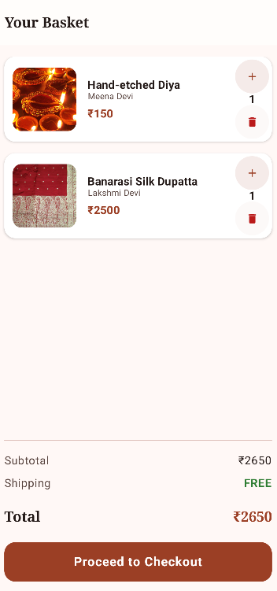
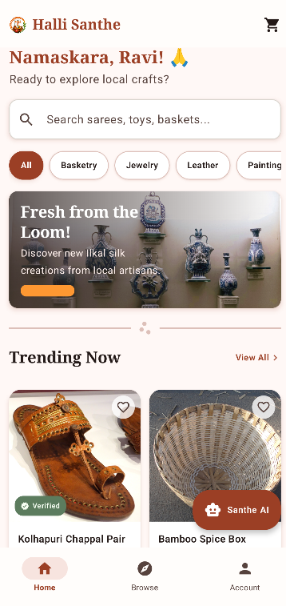
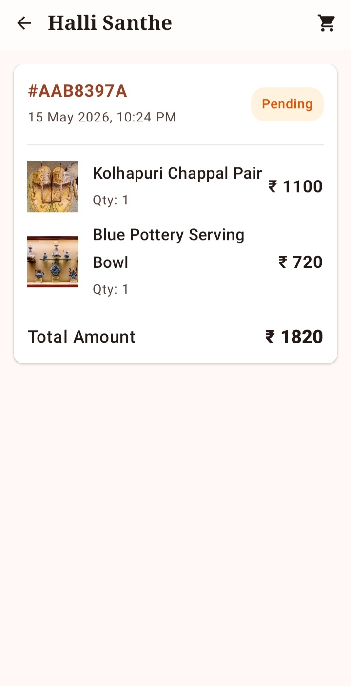
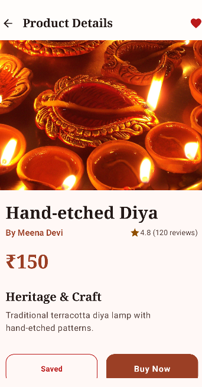
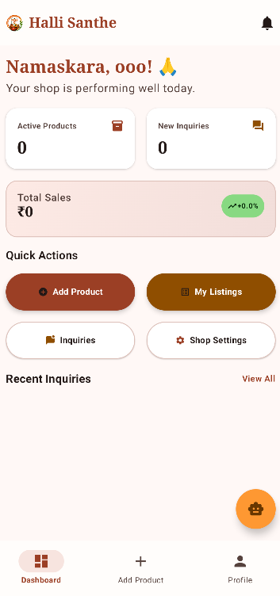
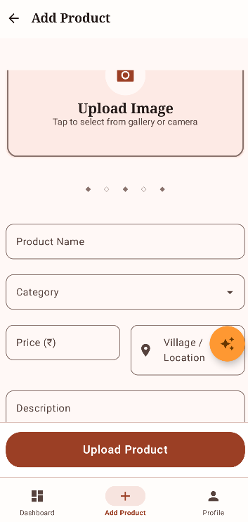

# Halli-Santhe 🌾

A modern Android marketplace application connecting rural artisans directly with buyers, showcasing traditional Indian handicrafts and agricultural products.

## 📱 Features

### For Buyers
- **Browse Products**: Explore a wide range of authentic handicrafts, textiles, and agricultural products
- **Search & Filter**: Find products by category, price range, and location
- **Secure Checkout**: Integrated payment gateway with multiple payment options
- **Order Tracking**: Real-time order status updates
- **Wishlist**: Save favorite products for later
- **Reviews & Ratings**: Share feedback on purchases

### For Sellers (Artisans)
- **Product Management**: Add, edit, and manage product listings
- **Order Management**: View and process incoming orders
- **Dashboard Analytics**: Track sales performance and revenue
- **Profile Management**: Showcase artisan story and expertise
- **Direct Communication**: Chat with buyers for inquiries

### Platform Features
- **Multi-language Support**: English, Hindi, Kannada
- **Location-based Discovery**: Find products from specific regions
- **Secure Authentication**: Google Sign-In and email/password
- **Real-time Notifications**: Order updates and promotional offers
- **Responsive Design**: Optimized for all screen sizes

## 🏗️ Architecture

### Tech Stack
- **Platform**: Android (Kotlin)
- **UI Framework**: Jetpack Compose
- **Architecture**: MVVM with Repository Pattern
- **Database**: Room (SQLite)
- **Networking**: Retrofit2 + OkHttp3
- **Image Loading**: Coil
- **Dependency Injection**: Hilt
- **Authentication**: Firebase Auth
- **Build System**: Gradle with Kotlin DSL

### Key Components
```
app/
├── data/
│   ├── local/          # Room database and DAOs
│   ├── remote/         # API services
│   ├── repository/     # Data repositories
│   └── viewmodel/      # ViewModels
├── ui/
│   ├── components/     # Reusable UI components
│   ├── screens/        # App screens
│   └── theme/          # Material Design 3 theming
└── utils/              # Utility classes
```

## 🚀 Getting Started

### Prerequisites
- Android Studio Hedgehog | 2023.1.1 or later
- Android SDK API 24 (Android 7.0) or higher
- Kotlin 1.9.0 or higher

### Installation

1. **Clone the repository**
   ```bash
   git clone https://github.com/Akhileshcgowda/hallisanthe.git
   cd hallisanthe
   ```

2. **Set up Firebase**
   - Create a Firebase project at [Firebase Console](https://console.firebase.google.com/)
   - Download `google-services.json` and place it in `app/`
   - Enable Authentication (Google Sign-In) and Firestore

3. **Configure API Keys**
   - Copy `app/google-services.json.example` to `app/google-services.json`
   - Create `local.properties` in the root directory:
     ```properties
     # Firebase configuration
     GEMINI_API_KEY=your_gemini_api_key_here
     GOOGLE_WEB_CLIENT_ID=your_google_web_client_id_here
     
     # Android SDK path
     sdk.dir=C\:\\Users\\YourUser\\AppData\\Local\\Android\\Sdk
     ```

4. **Build and run**
   ```bash
   ./gradlew assembleDebug
   # Install on device/emulator
   ./gradlew installDebug
   ```

## 📸 Screenshots

### Buyer Experience
| Home Screen | Product Details | Cart | Orders |
|-------------|----------------|------|--------|
|  |  |  |  |

### Seller Experience
| Dashboard | Add Product | Orders | Profile |
|-----------|-------------|--------|---------|
|  |  |  |  |

## 🎨 UI/UX Design

### Design System
- **Material Design 3**: Modern, adaptive design system
- **Color Palette**: Vibrant colors inspired by Indian culture
- **Typography**: Roboto font family for optimal readability
- **Icons**: Material Symbols with custom artisan-themed icons

### Key UI Components
- **Product Cards**: Rich product cards with images, pricing, and artisan info
- **Search Bar**: Advanced search with filters and suggestions
- **Bottom Navigation**: Intuitive navigation between main sections
- **Floating Action Button**: Quick access to add products (sellers)

## 🔧 Configuration

### Build Variants
- **debug**: Development build with logging and debug features
- **release**: Production build optimized for performance

### ProGuard
Release builds use ProGuard/R8 to shrink and obfuscate code, improving security and reducing APK size.

### Database Migrations
The app uses Room database with automatic migrations. Version history:
- v1: Initial schema
- v2: Added order tracking
- v3: Enhanced product attributes
- v4: Added wishlist functionality
- v5: Improved seller dashboard data
- v6: Added notification system
- v7: Enhanced image support with local drawables

## 🔒 Security

### Data Protection
- **API Keys**: Stored in `local.properties` and accessed via `BuildConfig`
- **Authentication**: Firebase Auth with secure token handling
- **Network Traffic**: HTTPS for all API communications
- **Local Storage**: Encrypted SharedPreferences for sensitive data

### Privacy
- No personal data is shared with third parties
- Location data used only for product discovery
- User can delete account and all associated data

## 🌐 API Integration

### External Services
- **Firebase Authentication**: User authentication and authorization
- **Firebase Firestore**: Cloud database for real-time data sync
- **Google Sign-In**: Social authentication
- **Gemini API**: AI-powered product recommendations and descriptions

### Image Sources
- **Wikimedia Commons**: High-quality images for sample products
- **Local Drawables**: Custom images for featured products
- **Coil Image Loader**: Efficient image loading with caching

## 🧪 Testing

### Unit Tests
- Repository and ViewModel testing with JUnit5
- Database testing with Room testing utilities
- Business logic validation

### UI Tests
- Compose UI testing with Espresso
- Navigation flow testing
- User interaction testing

### Test Coverage
- Target: 80%+ code coverage
- Continuous integration with GitHub Actions

## 📱 Supported Devices

### Minimum Requirements
- **Android Version**: 7.0 (API level 24)
- **RAM**: 2GB minimum
- **Storage**: 100MB free space
- **Network**: Internet connection required

### Optimized Devices
- **Screen Sizes**: Phones (4.7" - 6.7")
- **Tablets**: 7" - 10" tablets with adaptive UI
- **Orientations**: Portrait and landscape support

## 🤝 Contributing

We welcome contributions! Please follow these steps:

1. Fork the repository
2. Create a feature branch (`git checkout -b feature/amazing-feature`)
3. Commit your changes (`git commit -m 'Add amazing feature'`)
4. Push to the branch (`git push origin feature/amazing-feature`)
5. Open a Pull Request

### Code Style
- Follow [Kotlin coding conventions](https://kotlinlang.org/docs/coding-conventions.html)
- Use meaningful variable and function names
- Add KDoc comments for public APIs
- Keep PRs focused and minimal

## 📄 License

This project is licensed under the MIT License - see the [LICENSE](LICENSE) file for details.

## 👥 Team

- **Akhilesh C G** - Lead Developer & Architect
- **Contributors** - Amazing developers helping grow Halli-Santhe

## 🙏 Acknowledgments

- **Firebase** - Authentication and backend services
- **Jetpack Compose** - Modern UI toolkit
- **Material Design** - Design system and guidelines
- **Wikimedia Commons** - High-quality product images
- **All Artisans** - The heart and soul of Halli-Santhe

## 📞 Support

For support, please contact:
- **Email**: support@hallisanthe.com
- **Issues**: [GitHub Issues](https://github.com/Akhileshcgowda/hallisanthe/issues)
- **Documentation**: [Wiki](https://github.com/Akhileshcgowda/hallisanthe/wiki)

## 🗺️ Roadmap

### Upcoming Features
- [ ] Video product showcases
- [ ] AR product preview
- [ ] Multi-currency support
- [ ] Advanced analytics dashboard
- [ ] Offline mode support
- [ ] Voice search in local languages
- [ ] Integration with rural payment systems
- [ ] Supply chain tracking
- [ ] Artisan certification system

### Platform Expansion
- [ ] iOS app development
- [ ] Web platform
- [ ] Progressive Web App (PWA)
- [ ] Seller desktop dashboard

---

**Made with ❤️ for Indian artisans and rural empowerment**
